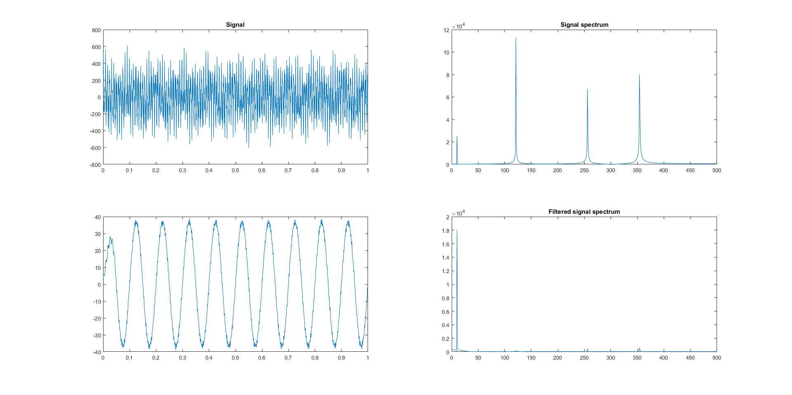
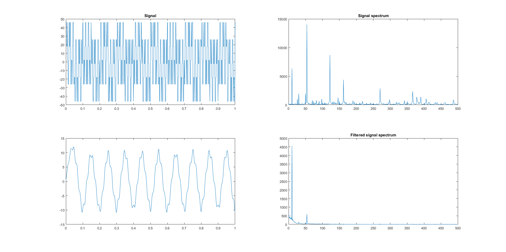
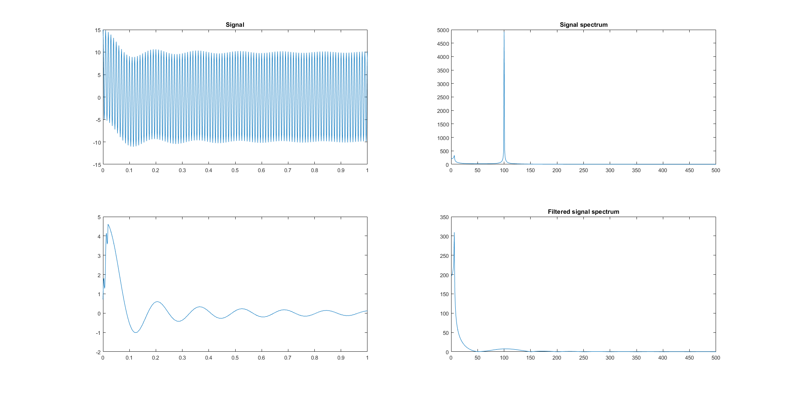

# Фильтр нижних частот

### Задание

В matlab разработать фильтр нижних частот и продемонстрировать его работу на различных функциях. В результате на графиках должна быть показана первоначальная функция, её спектр, отфильтрованная функция и её спектр.

### Входные данные

Параметры фильтра задаются в функции FIR_LPF(vec_y, order, fc, fs):

```
vec_y - исходный сигнал
order - порядок фильтра
fc - частота среза [Гц]
fs - частота дискретизации [Гц]
```

### Первый пример

```
vec_y = 50*cos(2*pi*10*x) + 231*cos(2*pi*121*x) + 200*sin(2*pi*354*x) + 150*sin(2*pi*256*x);
order = 50
fc = 10
fs = 1000
```


### Второй пример

```
vec_y = 10*square(2*pi*10*x) + 22*square(2*pi*54*x) + 14*square(2*pi*122*x);
order = 50
fc = 10
fs = 1000
```


### Третий пример

```
vec_y = 5*sinc(2*pi*2*x) + 10*cos(2*pi*100*x);
order = 20
fc = 2
fs = 1000
```

